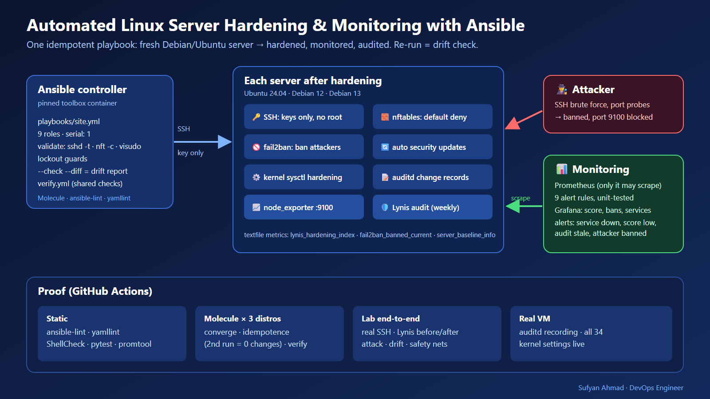
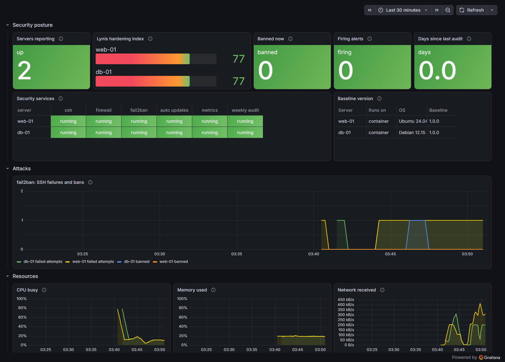

# Automated Linux Server Hardening & Monitoring with Ansible

One command turns a freshly installed Debian or Ubuntu server into a **hardened, monitored and audited** server:
- **Logins:** SSH keys only, and never as root.
- **Network:** a default-deny firewall, with fail2ban banning password guessers.
- **Updates:** automatic security updates.
- **Kernel and audit:** hardened kernel settings and an audit trail of important changes.
- **Monitoring:** Prometheus and Grafana watch every protection, and a weekly Lynis audit publishes a security score.

The playbook is **idempotent**: running it again changes nothing, so the same command also **detects drift** and **repairs it**.




> 📚 **New to DevOps? Start with the [study guide](study/README.md)** (also available as a single **[PDF](study/study-guide.pdf)**). It teaches every tool in this project from zero: Linux basics, SSH, Ansible, nftables, fail2ban, unattended-upgrades, sysctl, auditd, Lynis, Prometheus, Grafana, Molecule and GitHub Actions. It includes 9 hands-on labs and 25 interview questions.

> 🎬 **Prefer video?** A 19-minute walkthrough of every role, the safety nets, the measured attacks and drift, a hands-on lab on your laptop and the production rollout is built from code in [video/](video/README.md), with the YouTube upload package (description, chapters, captions, thumbnail).

**Measured in the lab** (2 servers, Ubuntu 24.04 + Debian 12, details in [docs/test-results.md](docs/test-results.md)):

| | Before | After |
|---|---|---|
| Lynis hardening index | 61 / 61 | **77 / 77** |
| Password login | accepted | **rejected** |
| Root login with a valid key | accepted | **rejected** |
| Login methods offered | publickey, password | **publickey** |
| Metrics port from an unknown host | (not installed) | **blocked** |
| SSH brute force (8 attempts) | nothing happens | **banned within seconds, alert in Prometheus** |
| Second run of the playbook | — | **0 changes** |

---

## 1. Problem statement

A new Linux server is not secure by default. Debian and Ubuntu install OpenSSH with password logins
switched on, and they allow root to log in with a key. The firewall is open, and nothing records who
changed what. Hardening is usually done by hand from a checklist, so every server ends up slightly
different. Nobody notices when someone later "temporarily" switches password login back on.

## 2. Pain point

- **Bots arrive within minutes:** internet-facing SSH ports receive password-guessing attempts almost
  as soon as they are online.
- **Manual hardening doesn't scale or repeat:** ten servers hardened by hand become ten different servers.
- **Drift is invisible:** a quick fix on one server stays forever, and nobody knows the baseline is broken.
- **One typo can lock you out:** a bad `sshd_config` or firewall rule cuts off the only way in.
- **"Is it secure?" has no number:** without an audit score you can't show progress or catch a regression.

## 3. Objectives

1. Apply the same security baseline to any number of Debian/Ubuntu servers with one command.
2. Make every change **safe**: validated before it is written, and guarded against lockout.
3. Make it **repeatable**: idempotent, so a re-run is a drift report (`--check --diff`) or a repair.
4. **Measure** the result with Lynis before and after, and keep measuring weekly.
5. **Monitor** the protections themselves: alert when a service stops, the score drops or an attacker is banned.
6. **Prove** all of it automatically: Molecule on 3 distributions, a lab end-to-end test with attacks, and a real VM.

## 4. Architecture

See [docs/architecture.md](docs/architecture.md) for the full design and the 15-entry decision log.

| Order | Role | Guarantees |
|---|---|---|
| 1 | `common` | admins with SSH keys only (other keys removed), sudo, banners, umask 027, no core dumps, persistent journal, no telnet/rsh |
| 2 | `kernel_hardening` | 34 sysctl settings persisted and applied; 9 rarely used kernel modules blocked |
| 3 | `ssh_hardening` | key-only, `AllowGroups ssh-users`, no root, no forwarding, modern ciphers/KEX/MACs, weak DH groups removed |
| 4 | `firewall` | nftables table `inet server_baseline`, input policy **drop**, one rule per allowed port and source |
| 5 | `fail2ban` | SSH jail from the journal, nftables bans, longer bans for repeat offenders, counters for Prometheus |
| 6 | `auto_updates` | daily security updates (unattended-upgrades), no surprise reboots |
| 7 | `auditd` | records changes to accounts, sudo, SSH, firewall, services, clock, modules and root commands |
| 8 | `node_exporter` | pinned, checksum-verified, sandboxed; systemd + textfile collectors |
| 9 | `lynis` | pinned Lynis 3.1.7, weekly audit timer, score exported as `lynis_hardening_index` |

**Safety nets, in the order they act:**
- **Guards:** the run stops if no admin key exists, if the allowed SSH groups are empty, or if the firewall has no SSH rule.
- **Validation:** every risky file is checked by the program that will read it (`sshd -t`, `nft -c`, `visudo -cf`) before it replaces the old one.
- **One server at a time:** `serial: 1`.
- **Access proof:** a brand-new SSH connection at the end proves access still works.

## 5. Technologies

| Tool | Version | Why it is here |
|---|---|---|
| Ansible (ansible-core) | 2.21.4 | agentless configuration over SSH; idempotent modules; check/diff mode for drift |
| Molecule + Docker driver | 26.9.0 / plugins 26.9.28 | test every role on Ubuntu 24.04, Debian 12, Debian 13 in systemd containers |
| ansible-lint / yamllint | 26.9.0 / 1.38.0 | production-profile linting |
| nftables | distribution | modern Linux firewall; own table so Docker/fail2ban rules stay untouched |
| fail2ban | distribution | bans addresses after repeated failed SSH logins |
| unattended-upgrades | distribution | automatic security updates |
| auditd | distribution | kernel audit trail of changes |
| Lynis | 3.1.7 (pinned, SHA-256) | security audit and hardening index, before/after and weekly |
| Prometheus | 3.15.0 | scrapes node_exporter, evaluates 9 alert rules (unit-tested with promtool) |
| node_exporter | 1.12.1 (pinned, SHA-256) | system, service-state and custom (textfile) metrics |
| Grafana | 13.2.3 | dashboard provisioned as code |
| GitHub Actions | — | static, Molecule, lab end-to-end and real-VM jobs |
| Python + pytest | 3.13 / 9.1.1 | Lynis report → Prometheus converter and its unit tests |

## 6. Repository structure

```
playbooks/        site.yml (apply) · verify.yml (check every control) · audit.yml (Lynis now)
roles/            common · kernel_hardening · ssh_hardening · firewall · fail2ban · auto_updates · auditd · node_exporter · lynis
                  each with tasks/main.yml and tasks/verify.yml (the role's own checks)
inventories/      lab/ (two lab servers over SSH) · local/ (the machine itself, used by the CI VM job)
molecule/default/ 3-distribution scenario: converge, idempotence, verify
lab/              compose.yaml · controller/ (pinned toolbox image) · target/ (fresh server image)
                  prometheus/ (scrape config + alert rules) · grafana/ (provisioning + dashboard)
scripts/          lab-up · lab-down · harden · audit · verify · drift-check · e2e · vm-test · lint
tests/            pytest for the Lynis converter · promtool tests for the alert rules
docs/             architecture · runbook · troubleshooting · test-results
study/            beginner study guide (+ PDF)
```

## 7. Prerequisites

- Docker with Compose v2 (Docker Desktop on Windows/macOS, Docker Engine on Linux).
- Bash: Git Bash on Windows works, and `make` is optional because every target is a script in `scripts/`.
- About 3 GB of free disk space for the images.

Everything else (Ansible, Molecule, linters, collections) is inside the pinned controller image.

## 8. Quick start

```bash
make lab-up              # two fresh servers (web-01 Ubuntu 24.04, db-01 Debian 12), attacker, Prometheus, Grafana
make audit LABEL=before  # Lynis score of the untouched servers
make harden              # apply the baseline (one server at a time)
make audit LABEL=after
make compare             # before/after table
make verify              # check every control
make drift               # what differs from the baseline? (changes nothing)
```

- **Grafana:** http://localhost:3000 (anonymous viewer; the admin password is in `.lab/grafana-admin-password`).
- **Prometheus:** http://localhost:9090

To run the whole proof from scratch (about 10 minutes): `make e2e`. It writes `reports/e2e-results.md`.

**Real servers:** copy `inventories/lab` to `inventories/<env>`, set `ansible_user`, `common_admin_users` and `firewall_rules`, then run:

```bash
ansible-playbook -i inventories/<env>/hosts.yml playbooks/site.yml --check --diff   # preview
ansible-playbook -i inventories/<env>/hosts.yml playbooks/site.yml --limit <one-host> # canary first
```

## 9. Configuration

The main variables, all with safe defaults in each role's `defaults/main.yml`:

| Variable | Default | Meaning |
|---|---|---|
| `common_admin_users` | `[]` (**required**) | `[{name, pubkeys: [...]}]`: the only people who can log in |
| `firewall_rules` | SSH from anywhere | `[{name, port, sources_v4, sources_v6}]`; everything else is dropped |
| `firewall_manage_forward` | `true` | drop forwarded traffic; set `false` on Docker/Kubernetes hosts |
| `ssh_hardening_allow_groups` | `[ssh-users]` | groups allowed to log in |
| `fail2ban_maxretry` / `findtime` / `bantime` | 5 / 10m / 1h | ban rule; repeat offenders get longer bans (up to 1w) |
| `fail2ban_ignoreip_extra` | `[]` | never ban these (controller, bastion) |
| `auto_updates_reboot` | `false` | reboot automatically after updates that need it |
| `kernel_hardening_sysctl_extra` | `[]` | extra kernel settings |
| `auditd_immutable` | `false` | lock audit rules until reboot |
| `lynis_schedule` | `weekly` | how often the audit runs |
| `baseline_serial` (extra var) | `1` | servers changed at the same time |

## 10. Testing

| Layer | Command | What it proves |
|---|---|---|
| Static | `make lint`, `make promtool` | yamllint, ansible-lint (production), syntax, ShellCheck, 7 unit tests, alert-rule unit tests |
| Molecule | `make molecule` | every role on Ubuntu 24.04, Debian 12, Debian 13: converge → idempotence (0 changes) → verify |
| Lab end-to-end | `make e2e` | real SSH: before/after logins and Lynis, firewall, brute-force ban + alert, unban, drift detect/repair, 3 safety nets, monitoring |
| Real VM | CI job `vm` (`scripts/vm-test.sh`) | idempotent on a real machine, all 34 kernel settings live, auditd rules loaded, Lynis 61 → 73 on a real kernel |

All four run in GitHub Actions on every push ([workflow](.github/workflows/ci.yaml)).

## 11. Results (measured)

Full numbers, commands and raw outputs: **[docs/test-results.md](docs/test-results.md)**.

## 12. Monitoring



The dashboard is provisioned from [lab/grafana/dashboards/server-baseline.json](lab/grafana/dashboards/server-baseline.json). It shows:
- the Lynis score per server
- banned addresses
- firing alerts
- days since the last audit
- every security service per server
- baseline version and OS
- fail2ban activity, CPU, memory and network

**Alert rules** ([lab/prometheus/rules/server-baseline.yml](lab/prometheus/rules/server-baseline.yml)), each with a promtool unit test:
- **Availability:** `ServerDown`
- **Protections:** `SecurityServiceNotRunning`, `AuditdNotRunning` (machines only), `Fail2banNotAnswering`
- **Audit:** `LynisScoreLow` (below 75), `LynisReportStale` (more than 8 days old)
- **Attacks:** `SSHAttackerBanned`
- **Housekeeping:** `MetricsFileBroken`, `DiskAlmostFull`

## 13. Security

- **Supply chain:**
  - node_exporter and Lynis are pinned and SHA-256 verified before unpacking.
  - Ansible collections and Python tools are pinned.
- **No secrets in git:**
  - The lab SSH key lives in a Docker volume; the Grafana password is generated into `.lab/` (ignored).
  - CI generates a throwaway key per run.
- **node_exporter is sandboxed:** it runs as its own user, with `ProtectSystem=strict`, no capabilities, and so on. The firewall only lets Prometheus reach it.
- **Lab caveat:** lab containers run privileged because systemd needs it. That is a lab pattern, not a production one.

## 14. Troubleshooting

See [docs/troubleshooting.md](docs/troubleshooting.md). It covers every problem met while building this:
- the lockout guards and validation errors
- the Lynis 403
- containers vs real kernels
- Windows path issues
- a precision bug caught by the unit tests

## 15. Failure scenarios

| Scenario | Expected | Measured (lab) |
|---|---|---|
| No admin key defined | run stops before SSH is touched | stopped by the lockout guard |
| Invalid firewall address | rejected before loading | `nft -c` rejected it; old rules active |
| Invalid SSH setting | rejected before writing | `sshd -t` rejected it; login still works |
| Someone re-enables password login, deletes the firewall, changes a kernel value | drift check lists exactly those | 3 drifted settings found; re-run restored them; check clean |
| SSH brute force | ban + alert | banned within seconds; alert firing in Prometheus |
| Manual unban | address leaves the firewall ban set | removed from fail2ban's nftables set |
| auditd in a container | not possible (kernel) | rules installed, service skipped; tested on the CI VM instead |

## 16. Operations

The [runbook](docs/runbook.md) covers:
- adding a server
- adding or removing admins
- opening ports
- drift checks
- unbanning addresses
- responding to each alert
- upgrading pinned tools
- rolling out to real servers

## 17. Cleanup

```bash
make lab-down   # removes containers, network and the key volume (reports/ is kept)
```

## 18. Limitations

- **Distributions:** Debian and Ubuntu only (apt, Debian service names).
- **No real cloud servers:** containers and a CI VM stand in for them. Containers cannot load audit rules or most kernel settings; the VM job covers those.
- **Lynis is a heuristic, not a compliance certificate:** the score shows direction, not "secure".
- **Single SSH port for everyone:** use a bastion or VPN if SSH should not be public.

## 19. Future improvements

- CIS Benchmark mapping per task, with a compliance report.
- Alertmanager routing (Slack/e-mail) and a nightly scheduled drift check in CI.
- TLS and basic auth on node_exporter.
- RHEL/Rocky support (dnf, firewalld coexistence).
- SSH certificates (a CA) instead of individual keys.

## 20. Learning resources

- **This project's [study guide](study/README.md) / [PDF](study/study-guide.pdf).**
- **Ansible:** [docs](https://docs.ansible.com/), [Molecule](https://ansible.readthedocs.io/projects/molecule/).
- **Hardening:** the CIS Benchmarks for Ubuntu/Debian, `man sshd_config`, [nftables wiki](https://wiki.nftables.org/).
- **Audit and monitoring:** [Lynis](https://cisofy.com/lynis/), [fail2ban](https://github.com/fail2ban/fail2ban), [Prometheus](https://prometheus.io/docs/), [node_exporter textfile collector](https://github.com/prometheus/node_exporter#textfile-collector).

## 21. Skills demonstrated

- **Configuration management:**
  - Ansible roles, handlers, templates and facts
  - idempotence, check/diff drift detection, serial rollout, `validate:`
- **Linux security:**
  - SSH hardening, nftables, fail2ban, unattended-upgrades
  - sysctl, kernel module blocking, auditd, Lynis
- **Safe automation:** lockout guards, validate-before-write, access proof after change.
- **Testing:** Molecule on 3 distributions, end-to-end tests with real attacks, a real-VM job, promtool and pytest.
- **Observability:** Prometheus textfile and systemd collectors, alert rules with unit tests, Grafana as code.
- **CI/CD:** GitHub Actions with 4 jobs and a pinned toolbox image shared by local and CI runs.

---
**Author:** Sufyan Ahmad · DevOps Engineer · [Portfolio](https://sufyanahmadkamboh.github.io/) · [LinkedIn](https://linkedin.com/in/sufyanahmadkamboh)
